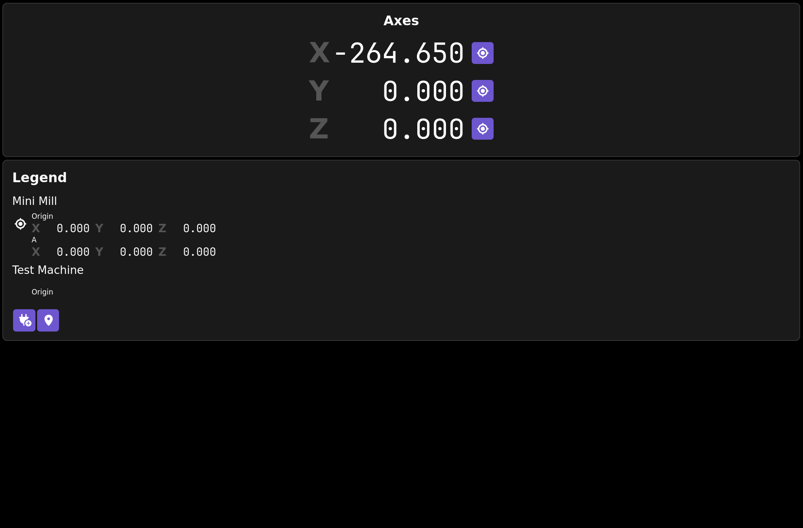
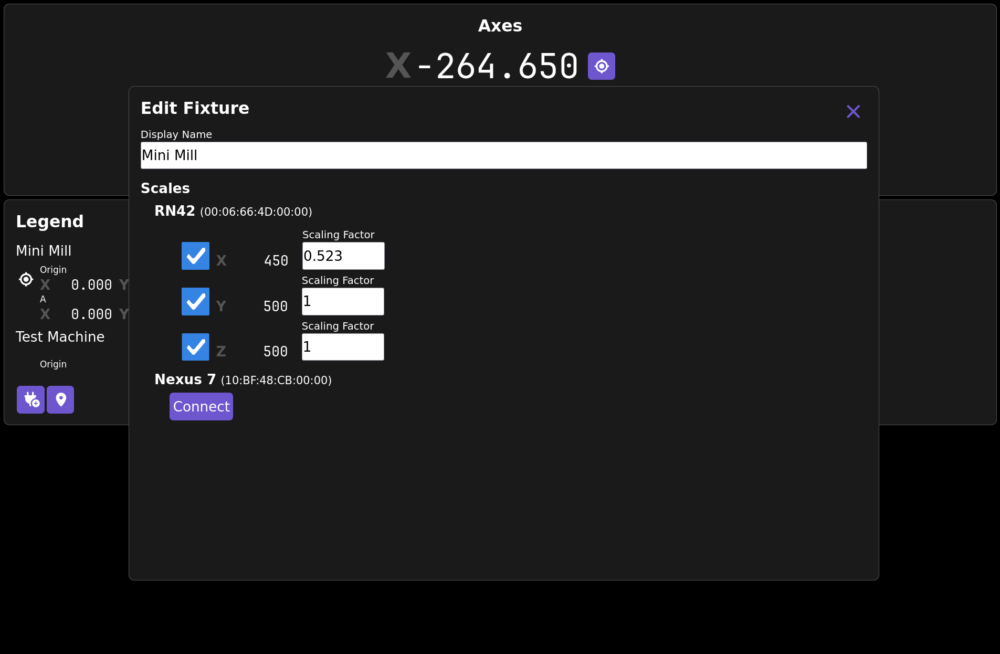

= Cadro

New DRO software for TouchDRO(-like) hardware.

NOTE: This is extremely alpha software!  This is here for early adopters
only!  I've only just got it just barely useable for my purposes!  I don't
even have scales on my mini-lathe, just my mini-mill!

== Why?

=== 1. Cadatious Antiskeuomorphism

_Skeuomorphism_ is a tendency to keep obsolete design elements or features,
often for familiarity's sake.  There's a story of an ancient civilization
which transitioned from copper pots to clay pots for water, but the potters
couldn't sell them without adding "rivets."  Perhaps this story is
apocryphal?  It sort of seems like it.

In DROs, we still have ABS and INC, things designed around old hardware
having only a few bytes of memory.
(And I can never remember whether datums are relative to ABS or INC?)  And
then they flip, and you are looking at one or the other and...

The question I want to ask with CaDRO is, "What if we just threw away the old
ideas and started over?  Can we make something that allows us to do new,
almost CNC-level things on manual machines?  Maybe we could mill a curve?"
The name is a purposeful portmanteau of CAD and DRO.

=== 2. Destructive Actions and Infinite Undo

TouchDRO's philosophy of warning on destructive actions like zeroing doesn't
help my ADHD-adled brain much.  I usually just power through those warnings,
confidently incorrect... or even sometimes I carefully reason and then find
out I'm wrong, which I guess is the slow form of confidently incorrect.

Even though it isn't implemented yet, CaDRO is designed so that _anything can
be undone_, including zeroing an axis.  There will be an undo button that
can unzero an axis, unadd a point, unscale an axis, undelete a machine, etc.

== How to Use

The primary abstraction is the "fixture tree" -- a tree of fixtures
(which are "machines" at the top level, and below that things like vises or
rotary tables or even parts) and reference points (what TouchDRO calls datums).
[Currently, only top-level machines and points are implemented.]
Fixtures can have transformations [very partially implemented] such as
rotations [not yet implemented] such that parts can be moved from one
fixture to another, or rotated.

The little plug icon adds a new machine and a starting Origin point.  The
Origin currently starts out with unset axis values, and you'll have to store
values.  I'm not sure if that's the right thing moving forward.

As long as there's at least one point, there will always a point selected as
"reference" or "target."  It has a target symbol next to it.  All other points
that share the same set of axes, and the current position of the scales, are
always displayed relative to the reference.  This builds on Yuri's wonderful
work-toward-zero philosophy.

You can select the reference point by tapping it.  You can edit a fixture
(and eventually a point) by long pressing it.

Clicking the target next to a scale value "stores" it to the reference point.
This is pretty much like zeroing.  Clicking the map pin "pins" the current
location, creating a point in the same fixture as the reference point that
is now zero (and making it reference).

One important point of "How to Use" Cadro is called "Yelling at the Author."
If this is neat, or useable, or unuseable, or it killed your cat, please
let me know.  If you have a cool idea for a feature, especially if it is
a powerful way of modeling the world that makes things simpler and allows
us to do more, I absolutely want to hear it.

== Building and Development

link:doc/development.adoc[Development Docs]

== Resources

* https://github.com/Aggebitter/TouchDRO-Simulator-on-ESP32[TouchDRO-Simulator-on-ESP32]
